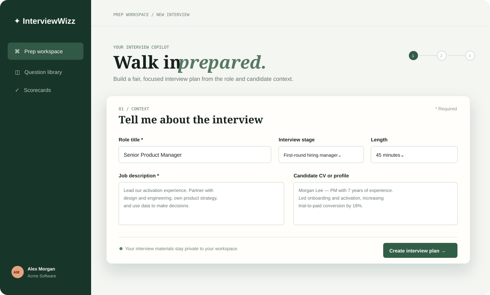
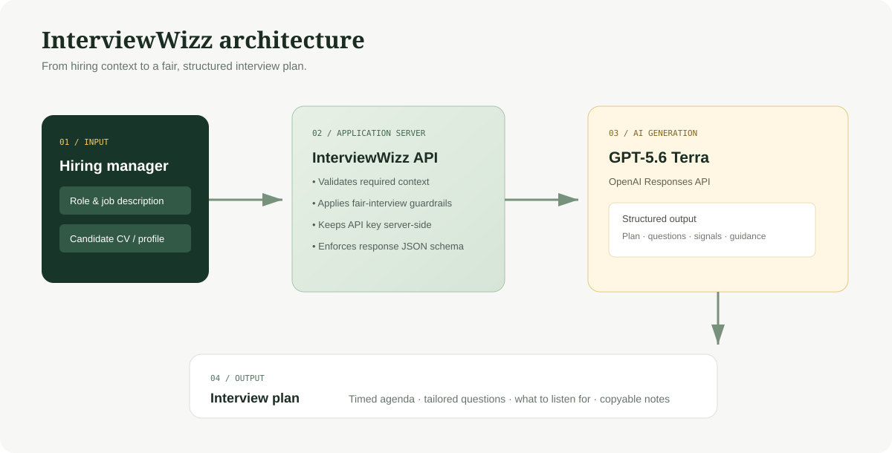

<div align="center">
  

  # InterviewWizz

  ### Better hiring conversations, prepared in minutes.

  Turn a job description and candidate CV into a focused, fair, and tailored interview plan with **GPT-5.6 Terra**.

  `Hiring manager copilot` &nbsp;·&nbsp; `Structured interview plans` &nbsp;·&nbsp; `Candidate-aware questions`
</div>

---

## Why InterviewWizz?

Great interviews are not improvised. InterviewWizz gives hiring managers a clear conversation structure before the meeting starts—without replacing their judgment.

| Bring | Get |
| --- | --- |
| Role title, job description, interview stage, and duration | A timed, role-relevant agenda |
| Candidate CV, LinkedIn profile, or notes | Questions tailored to the candidate’s evidence and growth areas |
| Your hiring judgment | Strong-answer signals and suggested follow-ups |

## The experience


1. **Set the context** — Add the role, stage, duration, job description, and optionally the candidate profile.
2. **Generate the plan** — Terra identifies job-relevant signals and produces a practical interview flow.
3. **Lead the conversation** — Use the timed questions, follow-up prompts, and answer-quality guidance in the interview.

## What it does

### Tailored interview plans

- Creates a realistic, time-boxed agenda for 30-, 45-, or 60-minute interviews.
- Covers opening, experience, judgment, collaboration or leadership, reflection, and closing.
- Adapts the balance of questions to the selected interview stage.

### Candidate-aware preparation

- Draws on the CV or profile only when it is supplied.
- Identifies useful evidence to probe, such as product depth, data fluency, cross-functional influence, or leadership scope.
- Avoids inventing experience when candidate context is incomplete.

### Fair, job-relevant guidance

- Keeps questions tied to the role and evidence required to do the work.
- Avoids protected-characteristic inferences and discriminatory questions.
- Frames “strong answers” as observable evidence, not a prescribed personality or background.

### Secure-by-design API boundary

- The browser never receives your OpenAI API key.
- The server validates input before calling the model.
- Responses use a strict JSON schema so the interface receives reliable, display-ready content.
- Requests use `store: false`.

## Architecture



| Component | Responsibility |
| --- | --- |
| **Prep workspace** (`index.html`, `styles.css`) | Hiring-manager UI for entering context and viewing the plan. |
| **Client controller** (`app.js`) | Sends preparation requests, renders the returned agenda, and supports copying the plan. |
| **Application server** (`server.js`) | Serves the app, validates input, applies interview guardrails, and protects credentials. |
| **OpenAI Responses API** | Runs `gpt-5.6-terra` with medium reasoning effort and structured output. |
| **Plan schema** | Guarantees title, summary, candidate insight, focus areas, and consistently shaped questions. |

## Tech choices

- **Frontend:** dependency-free HTML, CSS, and JavaScript
- **Backend:** Node.js built-in HTTP server
- **AI model:** `gpt-5.6-terra` via the OpenAI Responses API
- **Response contract:** JSON Schema / Structured Outputs

## Run locally

### 1. Add your API key

Copy `.env.example` to `.env` and replace the placeholder with your OpenAI API key.

```text
OPENAI_API_KEY=your_openai_api_key_here
PORT=3000
```

> Keep `.env` local. It is ignored by Git and should never be committed.

### 2. Start the app

```powershell
Get-Content .env | ForEach-Object { if ($_ -match '^([^#=]+)=(.*)$') { Set-Item -Path "Env:$($matches[1])" -Value $matches[2] } }
node server.js
```

Then open [http://127.0.0.1:3000](http://127.0.0.1:3000).

## Project structure

```text
InterviewWizz/
├── docs/
│   ├── architecture.svg            # System overview
│   └── interviewwizz-snapshot.svg  # Product snapshot
├── app.js                          # Browser-side generation and rendering
├── index.html                      # Prep workspace
├── server.js                       # Secure Terra integration
├── styles.css                      # Visual system and responsive layout
└── .env.example                    # Local configuration template
```

---

<div align="center">
  Built for hiring managers who want to arrive prepared, consistent, and curious. ✦
</div>
